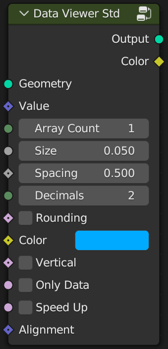

# 🐔Comparison

Data Viewer is available in three versions: Lite, Standard, and Professional. The lite version only supports a single array, the standard supports 3d arrays, such as position, rotation, etc. The Pro version adds some automatic processing, previews with axial arrows, and folding panel. Details are shown in the table below.

|    Features    |       Lite        |       Std        |       Pro        |
| :------------: | :---------------: | :--------------: | :--------------: |
|   Interface    |  |  |  |
|    3D Array    |         😭         |        😁         |        😃         |
|  Number Size   |         😁         |        😁         |        😁         |
| Number Spacing |         😁         |        😁         |        😁         |
|    Decimals    |         😁         |        😁         |        😃         |
|    Rounding    |         😁         |        😁         |        😁         |
|    Integer     |         😃         |        😃         |        😃         |
|  Ignore minus  |         😁         |        😃         |        😃         |
|   Alignment    |         😁         |        😁         |        😃         |
|    Vertical    |         😁         |        😁         |        😁         |
|   Only Data    |         😭         |        😁         |        😁         |
|    Speed Up    |         😭         |        😁         |        😁         |
|     Color      |         😭         |        😁         |        😁         |
| Gradient Color |         😭         |        😭         |        😁         |
|     Domain     |         😭         |        😭         |        😁         |
|      Axes      |         😭         |        😭         |        😁         |
|  Rotate Axes   |         😭         |        😭         |        😁         |
|   Folding UI   |         😭         |        😭         |        😁         |
|   Auto Mode    |         😭         |        😭         |        😁         |

> 😃 This is automatic, and some don't provide option settings.

