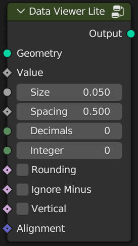
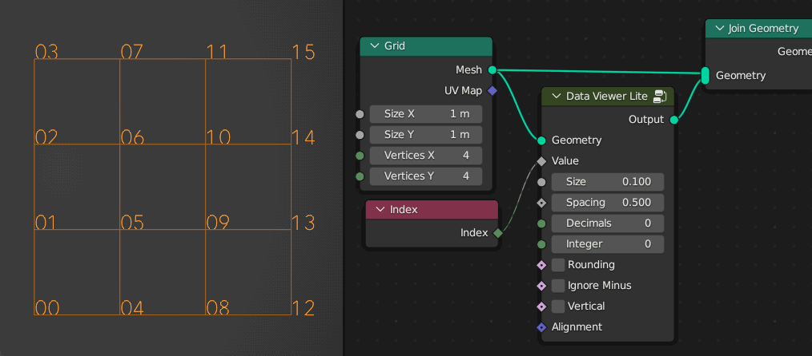
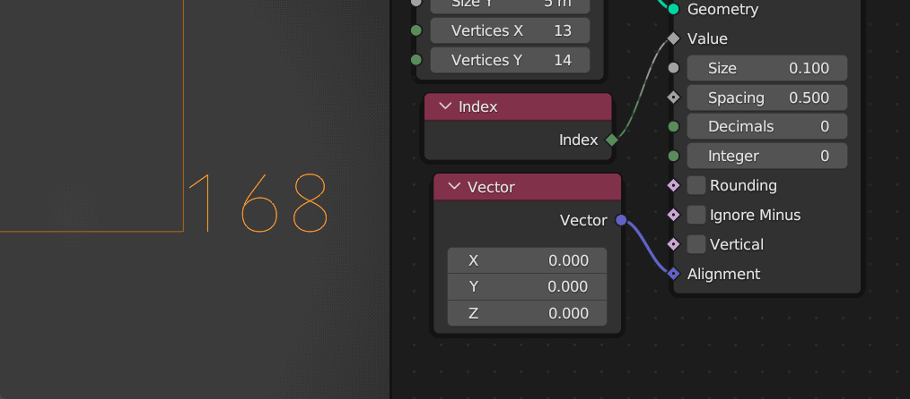
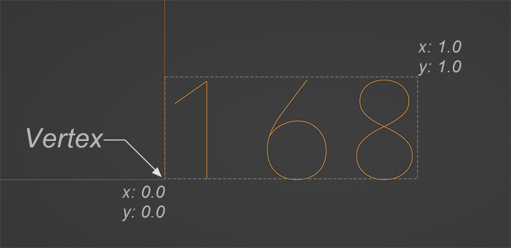

# Data Viewer Lite

**Geometry:** Connect the geometry object you want to view

**Value:** Connect the attribute to be viewed. The Lite version does not support 3D array.

**Size:** Set the size of the text.

**Spacing:** Set text spacing.

**Decimals:** Set the decimal length.

**Integer:** Set the integer length, automatically when the value is 0.

**Rounding:** Set decimal rounding.

**Ignore Minus:** Whether the minus sign should be considered in the alignment operation.

**Vertical:** vertical display.

**Alignment:** Align text to vertices. Range 0-1. When the value is (0 , 0), it will be aligned to the lower left corner of the text. When the value is (1, 1), it will be aligned to the upper right corner, 0.5 will center align. As shown below:

