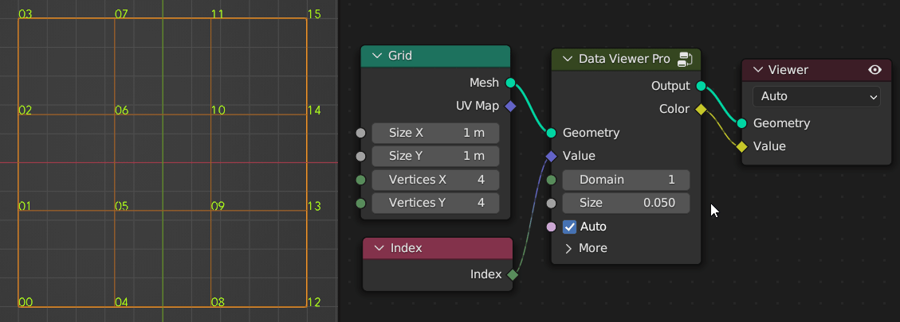
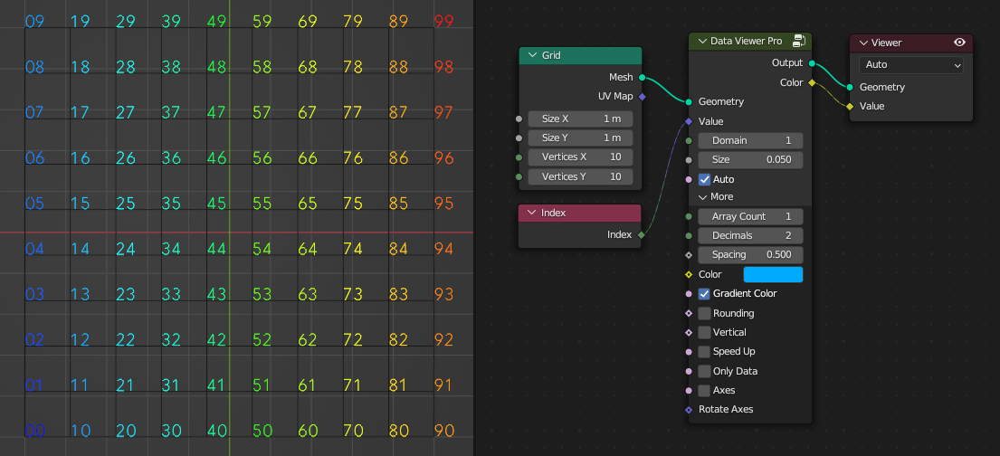
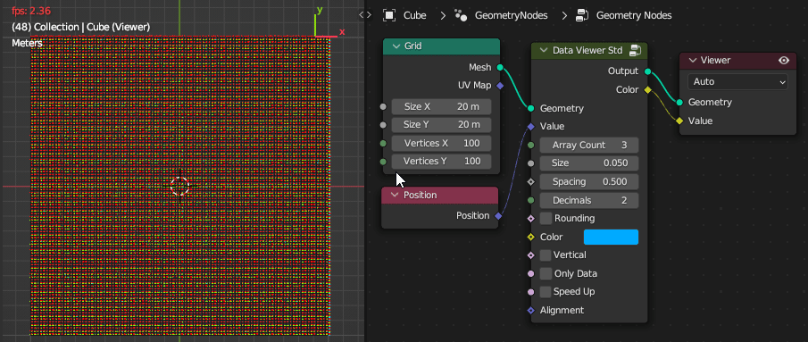

# Data Viewer Pro

**Geometry:** Connect the geometry object you want to view.

**Value:** Connect the attribute to be viewed. 

**Domain:** Set the domain to be viewed. The range is -2 to 5. A value of 0 is automatic mode, details are shown in the table below.

| Spline | Instance | Auto | Point | Edge | Face | Face Corner | Face & Corner |
| :----: | :------: | :--: | :---: | :--: | :--: | :---------: | :-----------: |
|   -2   |    -1    |  0   |   1   |  2   |  3   |      4      |       5       |

**Size:** Set the size of the text.

**Auto:** Automatically identify whether the input is an integer or a decimal, and the length of the array.

> **Note:** Sometimes it may be note accurate. Just turn off automatic and set it manually.

## **More Setting:**

**Array Count:** Set the length of the array, ranging from 1-3. When the input is an integer or float, the value should be 1. When the input is a vector, such as a position attribute, the value should be 3.

**Decimals:** Set the decimal length.

**Spacing:** Set text spacing.

**Color:** Set the color. When the array value is greater than 1, the color can be used to modify the saturation and brightness of RGB.

**Gradient Color:** Use color to mark the size of values. Blue represents the minimum, red represents the maximum.

**Rounding:** Set decimal rounding.

**Vertical:** vertical display.

**Speed Up:** Whether to enable speed up, which will be very helpful for large amounts of data.

> **Note:** Scene time nodes or key frames will reduce performance.

**Only Data:** Only display data.

**Axes:** Use axes instead of numbers. r, g, b corresponds to x, y, z respectively, and the darker colors are negative values. 

**Rotate Axes:** It can help you do some rotation tests, which will be useful when you are confused :P

> **Note:** Alignment options are not available in the pro version. Because it's all automatic. Edge, face and corner are aligned to the center, and everything else is aligned to the lower left corner. By the way, the point cloud will be automatically left aligned based on the radius, as shown in the figure below.

