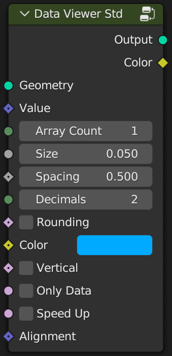
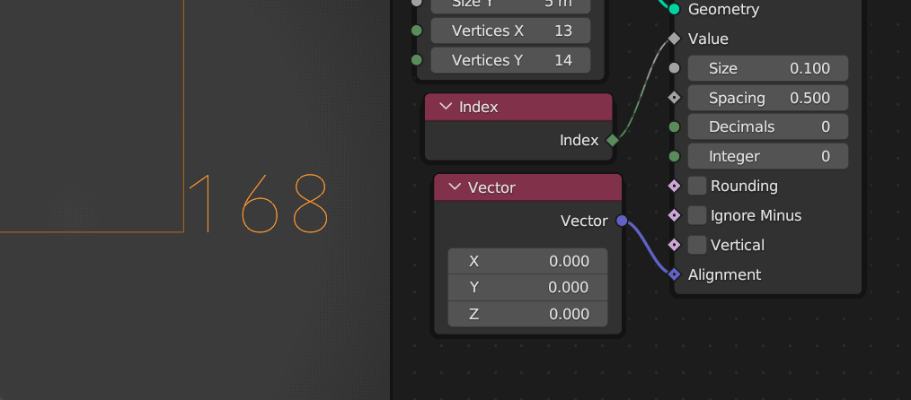

# Data Viewer Std

**Geometry:** Connect the geometry object you want to view.

**Value:** Connect the attribute to be viewed. 

**Array Count:** Set the length of the array, ranging from 1-3. When the input is an integer or float, the value should be 1. When the input is a vector, such as a position attribute, the value should be 3.

**Size:** Set the size of the text.

**Spacing:** Set text spacing.

**Decimals:** Set the decimal length.

**Rounding:** Set decimal rounding.

**Color:** Set the color. When the array value is greater than 1, the color can be used to modify the saturation and brightness of RGB.

**Vertical:** vertical display.

**Only Data:** Only display data.

**Speed Up:** Whether to enable speed up, which will be very helpful for large amounts of data.

> **Note:** Scene time nodes or key frames will reduce performance.

**Alignment:** Align text to vertices. Range 0-1. When the value is (0 , 0), it will be aligned to the lower left corner of the text. When the value is (1, 1), it will be aligned to the upper right corner, 0.5 will center align. As shown below:

