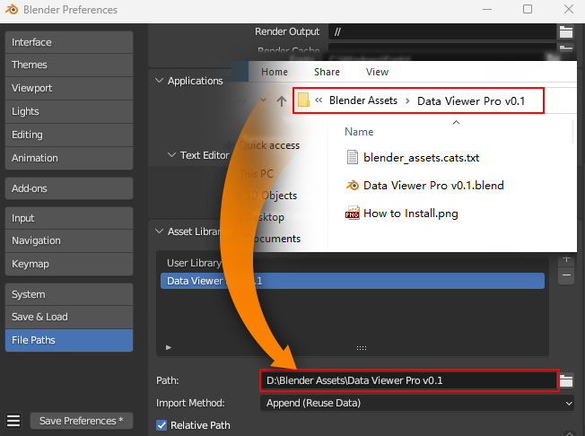
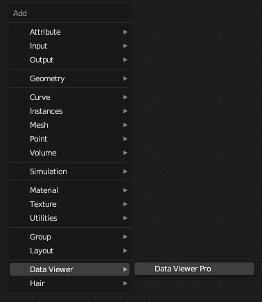
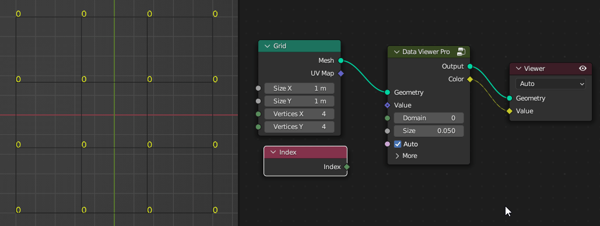
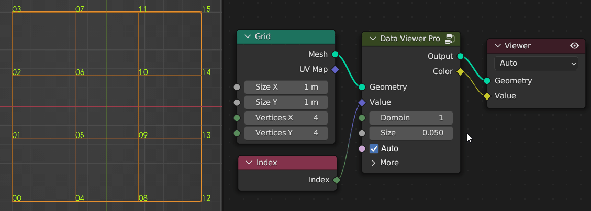
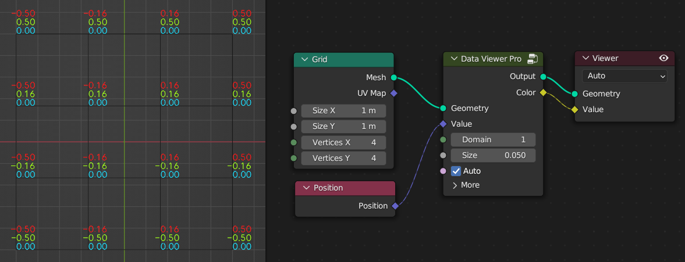
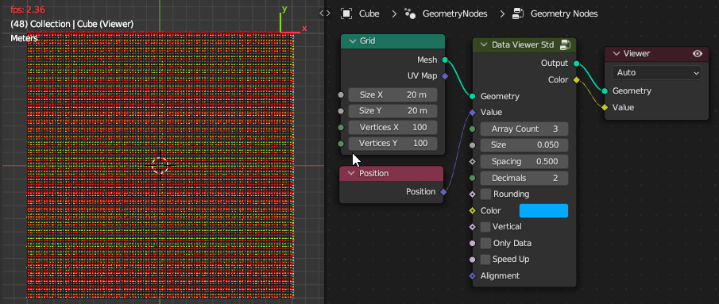
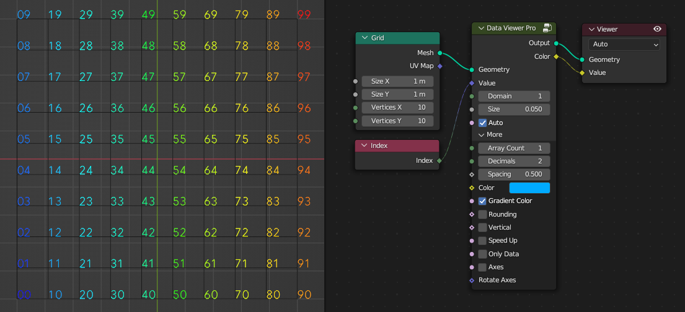
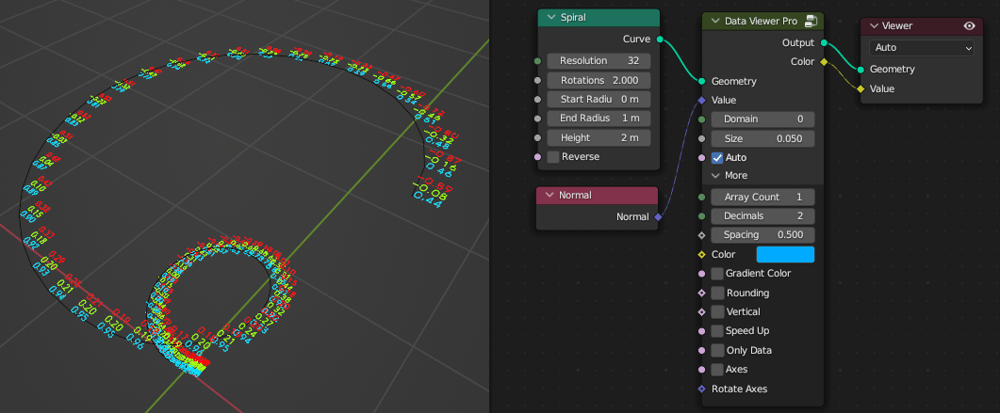
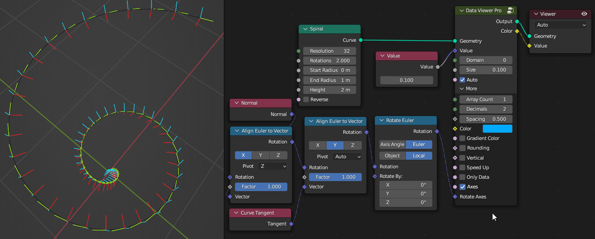
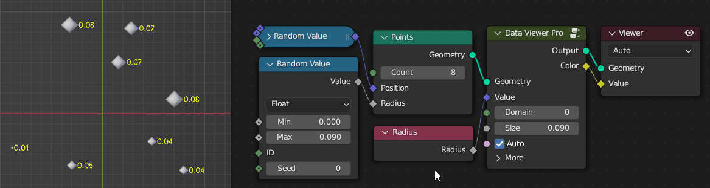

# 

# 🐰Introduction

Data Viewer allows you to more intuitively view the attributes of geometry in the 3D view without having to switch to the spreadsheet editor.  This can be useful for debugging and troubleshooting, as well as for understanding the structure and relationships of 3D models.

For example, you can preview the ID or index value of a vertex, edge, or face directly in the 3D view, which can make debugging easier. You can also view other attributes, such as position, rotation, and radius, depending on your input.

Data Viewer provides many custom parameters, such as field type, number color and size, flat or vertical orientation, decimal places, alignment, axial arrows, and optimization for large amounts of data.

I offer three versions of Data Viewer: Lite, Standard, and Professional. Please check out [comparison table](comparison.md) section

# 🐧Installation

You can get the latest version from [Blender Market](https://blendermarket.com/creators/cgpiece) or [Gumroad](https://cgpiece.gumroad.com/).

Since the Data viewer is a node group, you can put it in the asset path. After downloading, extract it to the path you want, usually you would store it with your other assets.

Open `Edit` - `Preference` - `File Paths`, add the path to `Asset Libraries`, and save it (automatically saved by default).

> Data viewer requires blender version at least 4.0.

# 🦄How to use

After installation, you can add Data Viewer node from the Add menu by pressing `Shift` + `A` in the geometry node editor, or drag the Data Viewer from the Asset Browser to the Geometry Node Editor.

If you want to preview the index of a grid, you can connect the nodes as follows.

The domain value is used to modify the domain to be viewed. The range is -2 to 5. A value of 0 is automatic mode, details are shown in the table below.

| Spline | Instance | Auto | Point | Edge | Face | Face Corner | Face & Corner |
| :----: | :------: | :--: | :---: | :--: | :--: | :---------: | :-----------: |
|   -2   |    -1    |  0   |   1   |  2   |  3   |      4      |       5       |

If you want to check the position information of the vertex, just replace the ID node with the position.

In addition, you can also modify the size of the numbers. For more options, you can also set vertical display, gradient color or axial arrows, etc.

The speed up option allows you to preview the large data more smoothly.

Use gradient color to mark the size of values. Blue represents the minimum, red represents the maximum.

You can also use axes instead of numbers. r, g, b corresponds to x, y, z respectively, and the darker colors are negative values.

 By the way, Rotate option allows you do some rotation tests, which will be useful when you are confused :P

View point cloud data.

For more information, please see the following chapters.

**Get more blender addons or tutorials：**

- [https://blendermarket.com/creators/cgpiece](https://blendermarket.com/creators/cgpiece)
- [https://cgpiece.gumroad.com](https://cgpiece.gumroad.com)
- [https://www.youtube.com/@cgpiece](https://www.youtube.com/@cgpiece)

*The font used is [Relief-SingleLine](https://github.com/isdat-type/Relief-SingleLine), designed by Élisa Garzelli & Noëlie Dayma. Many thanks to them!*
